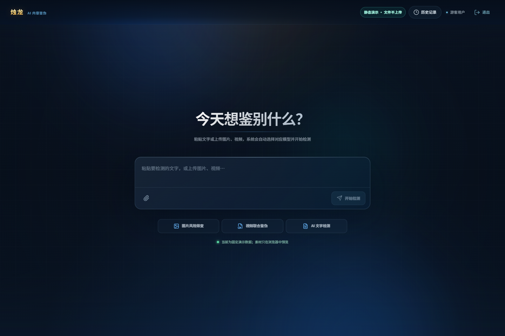
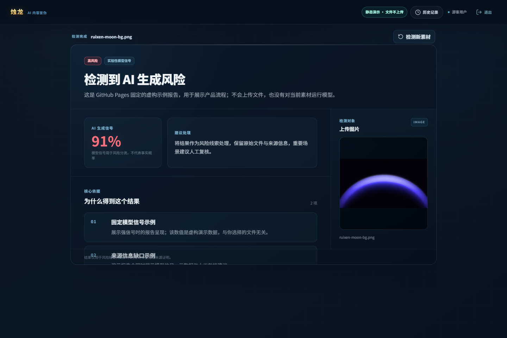

# 烛龙 · AI 内容风险分析工作台

[在线演示](https://godiceman.github.io/zhulong-ai-risk-workbench/) · [English](README_EN.md) · [隐私说明](PRIVACY.md) · [安全政策](SECURITY.md)

> 烛龙是一个本地优先的多模态 AI 内容风险分流原型：它组织模型信号、来源线索与能力边界，帮助人工复核，不提供通用的“真假认证”。



## 为什么做这个产品

单一“AI 概率”很容易被误解为事实结论。烛龙把输出拆成可检查的风险信号，在证据冲突、模型不可用或素材超出能力范围时明确弃权。

- 图片：DDA 主信号 + Community Forensics 独立辅助信号，结合 EXIF、XMP 和用户来源声明。
- 视频：AEGIS + D3 只在强共识时提示完整 AI 生成风险；LNCLIP-DF 独立提供人脸操纵信号。
- 文字：固定版本中文 BERT 分段分析写作风格信号，保留重点段落、采样覆盖率和正文指纹。



## 能力边界

| 模块 | 当前支持 | 不支持 |
| --- | --- | --- |
| 图片 | AI 生成风险信号、生成元数据、来源冲突与弃权 | 局部编辑定位、司法鉴定、通用真假认证 |
| 视频 | 完整生成强共识、清晰人脸操纵信号、保守的时序辅助 | 证明视频真实、音频伪造、无人脸换脸判定 |
| 文字 | 中文 AI 写作风格信号、分段解释、离线来源清单 | 作者身份认证、抄袭判断、联网事实核查 |

所有阴性或证据不足的结果均不得解释为“证明真实”。

## 在线演示与本地版

GitHub Pages 是一个不含后端和模型的静态产品演示。你可以体验上传、进度和报告界面，但：

- 文件只在浏览器本地预览，不会上传。
- 报告是明确标记的固定虚构数据，与你的输入无关。
- 真实模型推理只在按下文安装的本地版中运行。

## 本地运行

### 环境

- Windows 11（当前验证平台）
- Node.js 20.19+
- Python 3.11
- Git 与 [uv](https://docs.astral.sh/uv/)
- NVIDIA GPU 与兼容 CUDA 可显著缩短模型加载和推理时间；部分流程可回退 CPU

### 只启动前端

```powershell
Set-Location zhulong
npm ci
npm run dev:frontend
```

### 完整本地演示

```powershell
powershell -ExecutionPolicy Bypass -File scripts/setup_venv.ps1
powershell -ExecutionPolicy Bypass -File scripts/setup_video_forensics.ps1
./start.bat
```

首次安装会下载数 GB 的 Python/CUDA 依赖和多个固定版本模型。详细步骤见 [本地安装说明](docs/public/LOCAL_SETUP.md)。

## 架构

```text
Vue 3 / Pinia / Vite
        │
        ▼
Unified Media API :5002
   ├─ Image + Text Service :5004
   └─ Video Ensemble Service :5003
```

服务默认只监听 `127.0.0.1`。上传媒体处理后删除临时副本；报告默认只存于进程内存，只有显式设置 `PERSIST_REPORTS=true` 才会写入本地磁盘。详见 [架构说明](docs/public/ARCHITECTURE.md) 和 [隐私说明](PRIVACY.md)。

## 质量与证据

- 图片策略在 62 张本地小型回归集上以低误报为优先；明确弃权率较高，不能外推为生产准确率。
- 视频本地集上，完整生成分支覆盖率未达发布门槛，因此定位为低误报演示原型。
- 文字模型还没有完成独立的通用性评估，只能作为实验性写作风格信号。
- CI 验证前端生产构建和不需要大型权重的 API/决策策略测试。

可复核的版本、阈值、许可证门禁与局限见 [模型卡](docs/public/MODEL_CARD.md)。本仓库不包含评测媒体或模型权重。

## 开源边界

主项目源码使用 [MIT License](LICENSE)。模型、数据集与运行时依赖由各自上游条款约束，不因本项目使用 MIT 而自动获得商业使用权。详见 [第三方说明](THIRD_PARTY_NOTICES.md)。

## 协作方式

产品定义、界面与交互设计、验收和测试由项目发起者负责；工程实现包含 AI 编程工具在其指导和审核下的协作。

欢迎提交问题和小而可验证的改进，请先阅读 [贡献指南](CONTRIBUTING.md)。
